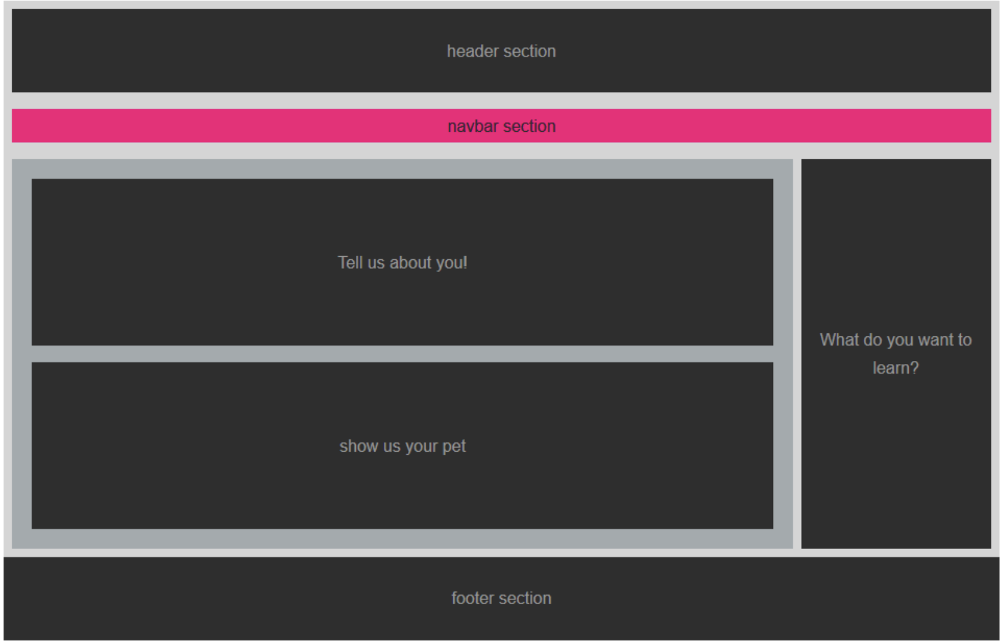
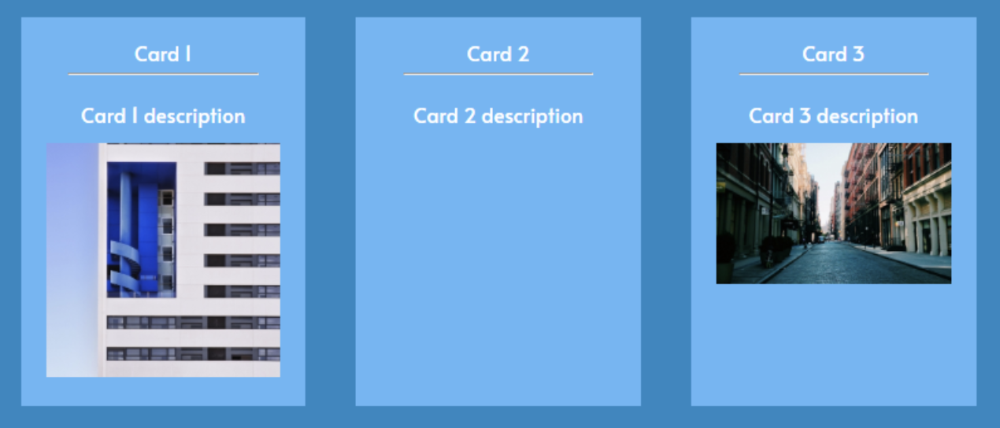
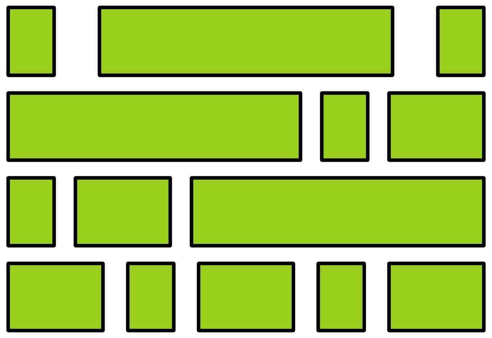

# Homeworks :house:

## 1. HTML

Replicar la siguien estructura en HTML con las etiquetas que mejor representen cada sección:

## 2. CSS

Trataran de replicar la siguiente estructura:

Deberas:

1. Crear una hoja de estilo separada
2. Justificar si agregas mas codigo HTML

> Opcional: Usar BEM

Puedes descargar el codigo html [aquí](https://jusk02.github.io/letsPracticeCss/homework.zip)

## 3. Tarea Git y Github:

Subir Todas las tareas que se han realizado a un repositorio en Github.

## 4. Flex:

1. Generar un HTML con siga la siguiente estructura con Flex:

2. Realizar la actividad propuesta en [FLEXBOX FROGGY](https://flexboxfroggy.com/)

> Opcional: Realizar el taller de [Flexbox Zombie](https://mastery.games/p/flexbox-zombies)

## 5. BEM

A partir de la estructura de la imagen propuesta:

1. Listar en un README los bloques, elementos y modificadores encontrados.
2. Crear la estructura en HTML.
3. Escribir las clases en CSS utilizando BEM.
4. Escribir los estilos de CSS correspondientes a la imagen.

